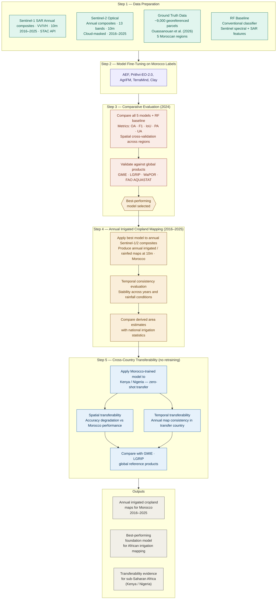

```mermaid
flowchart TD

    %% ── PHASE 1: INPUT DATA ──────────────────────────────────────────
    subgraph SRC ["Step 1 — Data Preparation"]
        direction TB
        S1["Sentinel-1 SAR Annual composites · VV/VH · 10m 2016–2025 · STAC API"]
        S2["Sentinel-2 Optical\nAnnual composites · 13 bands · 10m\nCloud-masked · 2016–2025"]
        GT["Ground Truth Data\n~9,000 georeferenced parcels\nOuassanouan et al. (2026)\n5 Moroccan regions"]
        RF["RF Baseline\nConventional classifier\nSentinel spectral + SAR features"]
    end

    %% ── PHASE 2: FINE-TUNING ─────────────────────────────────────────
    subgraph FT ["Step 2 — Model Fine-Tuning on Morocco Labels"]
        direction LR
        AEF["AEF, Prithvi-EO-2.0, AgriFM, TerraMind, Clay"]
    end

    %% ── PHASE 3: COMPARATIVE EVALUATION ─────────────────────────────
    subgraph EVL ["Step 3 — Comparative Evaluation (2024)"]
        direction TB
        CMP["Compare all 5 models + RF baseline\nMetrics: OA · F1 · IoU · PA · UA\nSpatial cross-validation across regions"]
        VAL["Validate against global products\nGMIE · LGRIP · WaPOR · FAO AQUASTAT"]
        BST{{"Best-performing\nmodel selected"}}
    end

    %% ── PHASE 4: ANNUAL MAPPING ──────────────────────────────────────
    subgraph ANN ["Step 4 — Annual Irrigated Cropland Mapping (2016–2025)"]
        direction TB
        MAP["Apply best model to annual Sentinel-1/2 composites\nProduce annual irrigated / rainfed maps at 10m · Morocco"]
        TMP["Temporal consistency evaluation\nStability across years and rainfall conditions"]
        STAT["Compare derived area estimates\nwith national irrigation statistics"]
    end

    %% ── PHASE 5: CROSS-COUNTRY TRANSFER ─────────────────────────────
    subgraph TRF ["Step 5 — Cross-Country Transferability (no retraining)"]
        direction TB
        TRFAPP["Apply Morocco-trained model to\nKenya / Nigeria — zero-shot transfer"]
        SPAT["Spatial transferability\nAccuracy degradation vs Morocco performance"]
        TEMP["Temporal transferability\nAnnual map consistency in transfer country"]
        TREF["Compare with GMIE · LGRIP\nglobal reference products"]
    end

    %% ── OUTPUTS ──────────────────────────────────────────────────────
    subgraph OUT ["Outputs"]
        direction LR
        O1["Annual irrigated cropland\nmaps for Morocco\n2016–2025"]
        O2["Best-performing\nfoundation model\nfor African irrigation mapping"]
        O3["Transferability evidence\nfor sub-Saharan Africa\n(Kenya / Nigeria)"]
    end

    %% ── CONNECTIONS ──────────────────────────────────────────────────
    SRC --> FT
    FT --> EVL
    CMP --> VAL
    VAL --> BST
    BST --> ANN
    MAP --> TMP
    TMP --> STAT
    STAT --> TRF
    TRFAPP --> SPAT
    TRFAPP --> TEMP
    SPAT --> TREF
    TEMP --> TREF
    TRF --> OUT

    %% ── STYLES ───────────────────────────────────────────────────────
    classDef teal    fill:#E1F5EE,stroke:#0F6E56,color:#085041
    classDef purple  fill:#EEEDFE,stroke:#534AB7,color:#26215C
    classDef coral   fill:#FAECE7,stroke:#993C1D,color:#712B13
    classDef amber   fill:#FAEEDA,stroke:#854F0B,color:#633806
    classDef blue    fill:#E6F1FB,stroke:#185FA5,color:#042C53
    classDef gray    fill:#F1EFE8,stroke:#5F5E5A,color:#2C2C2A
    classDef diamond fill:#FAEEDA,stroke:#854F0B,color:#633806

    class S1,S2,GT,RF teal
    class AEF,PRF,AGF,TRM,CLY purple
    class CMP,VAL coral
    class BST diamond
    class MAP,TMP,STAT amber
    class TRFAPP,SPAT,TEMP,TREF blue
    class O1,O2,O3 gray
```